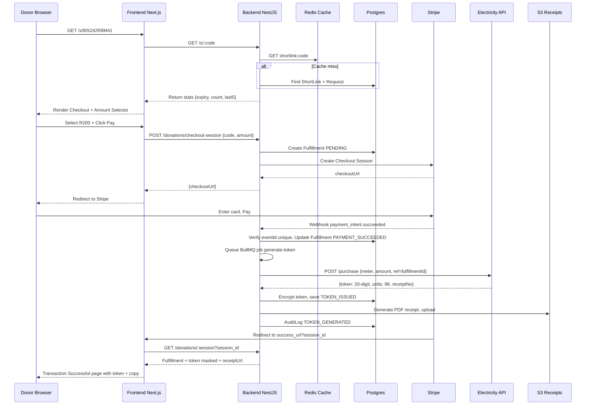

# 11 - App Flow Diagram - topmeup.io

## Textual Flow Summary

Below is visual diagram code in Mermaid. Render using https://mermaid.live or in markdown viewer.

```mermaid
flowchart TD
    A[User lands on topmeup.io\nEnter meter number UI\nAds top/bottom] --> B{Lookup Meter\nElectricity API}
    B -->|Invalid| B1[Show error\nRate limit + CAPTCHA]
    B1 --> A
    B -->|Valid| C[Show Address\n00 Southwest st Silverton 0184\nEmail + Mobile inputs\nSubmit]
    C --> D{Auth Check}
    D -->|Not Logged In| E[Auth Modal\nSign Up / Sign In\nPOPIA consent]
    E --> F[Create Session\nJWT Cookie]
    D -->|Logged In| F
    F --> G[POST /requests\nGenerate shortCode 10-char\nTTL 24h\nStore encrypted meter]
    G --> H[Share Page\nTopmeup.me/8IS242R8M41\nCopy button + Share icons x5\nCountdown 23:59:59]
    H --> I[Customer Dashboard\nActive Links | Fulfillments]
    H --> J{Donor opens Short URL}
    J --> K[GET /s/:code\nValidate expiry]
    K -->|Expired| K1[Expired Page\nOwner can Renew]
    K -->|Valid| L[Checkout Page\nDonate to: meter 012...\nAddress\nMasked requestor\nExpiry countdown\nFulfill count + Last5\nAmount selector R200 default\nPay button\nAds]
    L --> M[POST /donations/checkout-session\nCreate Fulfillment PENDING]
    M --> N[Redirect to Stripe Checkout]
    N --> O{Stripe Payment}
    O -->|Cancel| L
    O -->|Failed| O1[Show failure + retry]
    O -->|Success| P[Webhook payment_intent.succeeded\nVerify signature\nIdempotency]
    P --> Q[Job: Call Electricity API\npurchase token\nRef: donationId]
    Q -->|Fail -> Retry 5x| Q1[Mark TOKEN_FAILED\nAlert Admin\nOptional Refund]
    Q -->|Success| R[Encrypt token\nStore Fulfillment TOKEN_ISSUED\nUnits\nReceipt PDF S3\nIncrement Request count\nAudit log]
    R --> S[Redirect to /transaction/success?session_id]
    S --> T[Transaction Successful\nToken: 2874-4079-3286-8241\nUnits: 98.00\nAmount: R200.00\nCopy + Share + Receipt Download\nAds]
    T --> U[Notify Requestor via Email/SMS\nToken delivered]
    I --> V[Admin Dashboard\nAll Requests + Fulfillments\nAudit Logs\nRetry/Refund actions]
    R --> V
```

## Sequence Diagram - Token Fulfillment



## State Machines

### Request
```
[DRAFT] --lookup ok+auth--> [ACTIVE] --24h timer--> [EXPIRED]
   |                            |--revoke--> [REVOKED]
```

### Fulfillment
```
[PENDING_PAYMENT] --Stripe session created--> 
[PAYMENT_SUCCEEDED] --job queued--> [TOKEN_REQUESTED] --API success--> [TOKEN_ISSUED]
                                                   --API fail after retries--> [TOKEN_FAILED] --refund--> [REFUNDED]
[PENDING_PAYMENT] --cancel/timeout--> [CANCELED]
```

### ShortLink
```
[ACTIVE] --expired--> [EXPIRED]
[ACTIVE] --admin revoke--> [REVOKED]
```

## Roles & Access Matrix

| Action | Anonymous | USER Owner | USER Other | ADMIN |
|--------|-----------|------------|------------|-------|
| Lookup meter | ✅ | ✅ | ✅ | ✅ |
| Create request | ❌ | ✅ | ✅ | ✅ |
| View own requests | ❌ | ✅ own | ❌ | ✅ all |
| Resolve short link | ✅ | ✅ | ✅ | ✅ |
| Create checkout | ✅ | ✅ | ✅ | ✅ |
| View token (reveal) | ❌ donor session limited | ✅ own requests | ✅ if donor session valid 10min | ✅ all |
| Revoke own link | ❌ | ✅ | ❌ | ✅ |
| Admin dashboard | ❌ | ❌ | ❌ | ✅ MFA |

## Navigation Map

```
/
  |-- /about, /services, /contact (static)
  |-- /auth/signin, /auth/signup, /auth/forgot
  |-- /dashboard (customer) -> /dashboard/requests/:id
  |-- /admin (admin only)
  |-- /s/:shortCode (public checkout)
  |-- /transaction/success?session_id= (public with session id)
  |-- /transaction/canceled
  |-- /privacy, /terms, /security
```

## Visual Sketch to Code Mapping

- Sketch page with Ads top/bottom = shell with AdSlot components
- Center card with "Enter meter number ->" = LandingMeterCard component
- Card showing meter + address + email/phone + Submit = ValidatedMeterCard
- Card showing topmeup.io/xxx + Copy + Share icons = ShareCampaignCard
- Checkout showing donate electricity to + meter + amount R200 + Pay = CheckoutDonationCard
- Transaction Successful with token 2874-4079-... + Copy + Share = SuccessTokenCard
- Combined view in last sketch = responsive stacking of checkout + success in storybook.

---

### To render diagram quickly, copy mermaid code to https://mermaid.live

We also provide interactive HTML version at ./diagrams/app-flow-interactive.html
